# MailGuard Complete Process Flow Documentation

## Overview
This document provides a comprehensive step-by-step explanation of the MailGuard email security analysis process, from user authentication to ongoing protection.

## Process Flow Diagram

```mermaid
graph TD
    %% User Authentication & Setup
    A[👤 User Visits /auth] --> B{Already Registered?}
    B -->|No| C[📝 Sign Up Process]
    B -->|Yes| D[🔐 Login Process]
    C --> E[✅ Auto-create Profile, Roles, Preferences]
    D --> F[🏠 Redirect to Dashboard]
    E --> F
    
    %% Outlook Integration
    F --> G{Outlook Connected?}
    G -->|No| H[🔗 Click Connect Outlook]
    G -->|Yes| M[📧 Ready for Email Sync]
    H --> I[🌐 Microsoft OAuth Flow]
    I --> J[🔑 Exchange Code for Tokens]
    J --> K[💾 Store Tokens in outlook_tokens]
    K --> L[✅ Outlook Connected]
    L --> M
    
    %% Email Sync Process
    M --> N[🔄 User Clicks Sync Emails]
    N --> O[🗑️ Clear Previous Data]
    O --> P[📨 Call fetch-outlook-emails Function]
    P --> Q[🔍 Get Access Token from DB]
    Q --> R[📬 Fetch Emails from Microsoft Graph]
    R --> S[🔄 Deduplicate by message_id]
    
    %% ML Analysis Engine
    S --> T[🤖 Start ML Analysis Engine]
    T --> U[📚 Load Training Dataset - 40+ Examples]
    U --> V[🔄 For Each Unique Email]
    
    V --> W[🧠 Naive Bayes Classification]
    V --> X[🛡️ Sender Security Analysis]
    V --> Y[🎯 Content Pattern Detection]
    V --> Z[💭 Local Sentiment Analysis]
    V --> AA[✏️ Misspelling Detection]
    V --> BB[🔗 URL Analysis]
    
    %% Analysis Combination
    W --> CC[⚖️ Combine All Scores]
    X --> CC
    Y --> CC
    Z --> CC
    AA --> CC
    BB --> CC
    
    CC --> DD[📊 Calculate Final Threat Level]
    DD --> EE[🏷️ Assign Threat Type]
    
    %% Data Storage
    EE --> FF[💾 Store Email in emails Table]
    FF --> GG[📈 Update email_statistics]
    GG --> HH{High Threat Detected?}
    HH -->|Yes| II[🚨 Create Alert in email_alerts]
    HH -->|No| JJ[✅ Continue Processing]
    II --> JJ
    
    %% Dashboard Display
    JJ --> KK{More Emails to Process?}
    KK -->|Yes| V
    KK -->|No| LL[📊 Update Dashboard in Real-Time]
    LL --> MM[📈 Display Analytics & Statistics]
    MM --> NN[📋 Show Email List with Threat Levels]
    
    %% Ongoing Protection
    NN --> OO[🔄 Continuous Monitoring]
    OO --> PP[🚫 Block Sender Functionality]
    OO --> QQ[📱 Real-Time Alerts]
    OO --> RR[🎯 Adaptive Learning from Feedback]
    
    %% Data Flow Styling
    classDef userAction fill:#e1f5fe,stroke:#01579b,stroke-width:2px
    classDef systemProcess fill:#f3e5f5,stroke:#4a148c,stroke-width:2px
    classDef mlProcess fill:#e8f5e8,stroke:#1b5e20,stroke-width:2px
    classDef dataStorage fill:#fff3e0,stroke:#e65100,stroke-width:2px
    classDef security fill:#ffebee,stroke:#b71c1c,stroke-width:2px
    
    class A,B,C,D,H,N userAction
    class F,I,J,L,P,Q,R,S,LL,MM,NN systemProcess
    class T,U,V,W,X,Y,Z,AA,BB,CC,DD,EE mlProcess
    class E,K,FF,GG,II dataStorage
    class O,HH,OO,PP,QQ,RR security
```



## Detailed Step-by-Step Process

### 🔐 Step 1: User Authentication & Setup

#### 1.1 User Registration/Login
- User visits `/auth` page
- Signs up/logs in via Supabase Auth (email/password)
- System automatically creates:
  - Profile in `profiles` table
  - Default user role in `user_roles` table
  - Privacy-first preferences in `user_preferences` table

#### 1.2 Initial Setup
- User redirected to main dashboard (`/`)
- System checks if Outlook is connected
- If not connected, shows "Connect Outlook" button

### 🔗 Step 2: Outlook Integration

#### 2.1 OAuth Flow Initiation
- User clicks "Connect Outlook"
- System calls `outlook-auth` edge function
- Redirects to Microsoft OAuth consent screen

#### 2.2 Token Exchange
- User grants permissions to MailGuard
- Microsoft redirects back with authorization code
- System exchanges code for access/refresh tokens
- Tokens stored securely in `outlook_tokens` table

### 📧 Step 3: Email Sync Process

When user clicks "Sync Emails":

#### 3.1 Clear Previous Data
```typescript
// Clear existing emails for fresh sync
await supabase.from('emails').delete().eq('user_id', userId);
await supabase.from('email_statistics').delete().eq('user_id', userId);
```

#### 3.2 Fetch from Outlook
- `fetch-outlook-emails` function called
- Retrieves access token from database
- Makes API call to Microsoft Graph: `/me/messages`
- Fetches recent emails (subject, sender, content, date)

#### 3.3 Deduplication
- Uses `message_id` to identify unique emails
- Prevents processing same email multiple times

### 🤖 Step 4: Local ML Analysis Engine

For **each unique email**, the system runs comprehensive analysis:

#### 4.1 Initialization
```typescript
// Load training dataset (40+ real examples)
const classifier = new RobustEmailClassifier();
await classifier.loadTrainingData();
```

#### 4.2 Multi-Layer Analysis

##### A. Naive Bayes Classification
- Tokenizes email content
- Compares against trained dataset
- Calculates spam probability score

##### B. Sender Security Analysis
- Domain reputation check
- SPF/DKIM validation patterns
- Known suspicious domains

##### C. Content Pattern Detection
- Scam patterns (urgent language, fake prizes)
- Phishing indicators
- Malware-related keywords

##### D. Local Sentiment Analysis
- Positive/negative/neutral classification
- Toxicity scoring based on word patterns
- No external API calls

##### E. Misspelling Detection
- Identifies suspicious typos
- Common scammer spelling mistakes

##### F. URL Analysis
- Suspicious link detection
- Domain reputation scoring

#### 4.3 Final Classification
```typescript
// Combine all analysis scores
const finalThreatLevel = calculateCombinedScore({
  naiveBayesScore,
  senderSecurity,
  scamPatterns,
  sentiment,
  misspellings,
  urlAnalysis
});

// Determine threat level: safe, low, medium, high
// Determine threat type: spam, phishing, malware, suspicious
```

### 💾 Step 5: Data Storage

#### 5.1 Email Storage
```typescript
// Store analyzed email
await supabase.from('emails').insert({
  user_id,
  subject,
  sender,
  content,
  threat_level,
  threat_type,
  confidence,
  classification,
  keywords
});
```

#### 5.2 Statistics Update
```typescript
// Update daily statistics
await supabase.rpc('increment_email_statistics', {
  p_user_id: userId,
  p_threat_level: threatLevel,
  p_threat_type: threatType
});
```

#### 5.3 Alert Generation
- If high-threat email detected
- Creates entry in `email_alerts` table
- Triggers admin notification (if configured)

### 📊 Step 6: User Dashboard Display

#### 6.1 Real-Time Updates
- Dashboard shows sync progress
- Live statistics updates during processing

#### 6.2 Analytics Display
- Total emails processed
- Threat level breakdown (safe/low/medium/high)
- Threat type distribution (spam/phishing/malware)
- Daily statistics charts

#### 6.3 Email Management
- List of all analyzed emails
- Filter by threat level/type
- Block sender functionality
- Detailed analysis results

### 🛡️ Step 7: Ongoing Protection

#### 7.1 Real-Time Analysis
- New emails automatically analyzed
- Continuous threat monitoring

#### 7.2 Adaptive Learning
- User feedback improves detection
- Blocked senders added to blacklist

#### 7.3 Security Alerts
- High-threat emails trigger alerts
- Admin dashboard for oversight

## Process Legend

### 🔵 User Actions (Light Blue)
- Sign up, login, connect Outlook, sync emails

### 🟣 System Processes (Purple) 
- OAuth flows, API calls, dashboard updates

### 🟢 ML Analysis (Green)
- Local machine learning, pattern detection, scoring

### 🟠 Data Storage (Orange)
- Database operations, profile creation, email storage

### 🔴 Security & Alerts (Red)
- Data clearing, threat detection, alerts, monitoring

## 🔒 Privacy & Security Features

- **Privacy-First**: Users can set "never store data" preference
- **Row-Level Security**: Each user only sees their own data
- **Local Processing**: No emails sent to external APIs
- **Encrypted Storage**: Sensitive data properly secured

## 📈 Admin Features (for admin users)

- View all user activities
- Manage email alerts
- Audit trail of all actions
- System-wide analytics

## 🏗️ Key Architecture Highlights

1. **Privacy-First**: All ML analysis happens locally - no external API calls
2. **Comprehensive Analysis**: 6-layer analysis engine for accurate threat detection  
3. **Real-Time Processing**: Live updates during email sync and analysis
4. **Adaptive Security**: Continuous learning and threat monitoring
5. **User Control**: Block senders, manage preferences, view detailed analysis

## Technical Implementation Details

### Edge Functions Used
- `outlook-auth`: Handles Microsoft OAuth flow
- `fetch-outlook-emails`: Syncs emails from Outlook
- `robust-email-classifier`: Performs ML analysis
- `chat-assistant`: AI-powered email security advice
- `create-outlook-mail-rule`: Creates blocking rules in Outlook

### Database Tables
- `profiles`: User profile information
- `user_roles`: Role-based access control
- `user_preferences`: Privacy and notification settings
- `outlook_tokens`: OAuth tokens for Outlook integration
- `emails`: Analyzed email data
- `email_statistics`: Daily email statistics
- `email_alerts`: Security alerts and notifications
- `email_blocks`: Blocked sender information
- `user_feedback`: User feedback and ratings

### Security Measures
- Row-Level Security (RLS) on all tables
- Encrypted token storage
- Privacy-first data handling
- Local ML processing (no external APIs)
- Admin audit trails

This comprehensive process ensures enterprise-grade email security analysis while maintaining complete user privacy and data control.